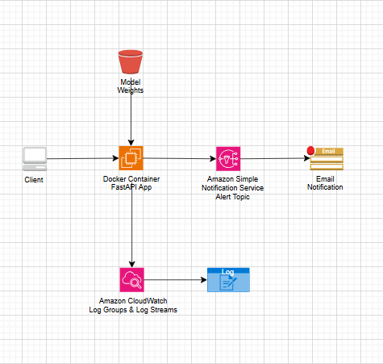

# Violence Detection and Alert System (Inference & Deployment Focused)

### Overview

This project implements a violence detection inference system using a deep learning model, deployed as a containerized FastAPI service on AWS EC2. The system performs video-based inference and sends email alerts using Amazon SNS when high-confidence violence is detected. Application logs are collected using Amazon CloudWatch.

The primary goal of this project is to demonstrate how a trained machine learning model can be served, containerized, deployed, and monitored in the cloud in a cost-efficient manner using AWS Free Tier resources.

### Problem Statement

Violence detection systems are often demonstrated only at the model level, without addressing how such models can be served, monitored, and integrated into real systems.

This project addresses the following problem:

How can a trained deep learning model for violence detection be served as a reliable inference service that can:
- Accept video inputs
- Perform automated violence detection
- Trigger alerts on high-confidence events
- Be deployed and monitored in the cloud at zero cost

### Solution Architecture



#### Architecture Design Rationale

1. Amazon EC2 was chosen over serverless options to support long-running video inference, large ML dependencies, and stateful model loading.
2. Docker is used to ensure environment consistency across local development and cloud deployment.
3. FastAPI was selected for its simplicity, performance, and automatic API documentation.
4. Amazon SNS provides a lightweight and reliable email-based alerting mechanism.
5. Amazon CloudWatch Logs are used to centralize application logs for basic observability and debugging.

### Tech Stack Used

**Machine Learning**
- Python
- TensorFlow
- MobileNetV2 + BiLSTM 

**Backend & Deployment**
- FastAPI
- Uvicorn
- Docker

**AWS Services**
- Amazon EC2 (t2.micro)
- Amazon SNS (Email alerts)
- Amazon CloudWatch (Logs)

### Model Inference Logic

Input video is read frame-by-frame using OpenCV. The frames are first resized and normalised, then a fixed sequence is passed to the model. The model was trained from scratch on a local laptop and reused here only for inference. Predictons are smoothed using a sliding window. Final output includes label (Violence / NonViolence), confidence score, alert (flag), timestamp.

### API Interface

**Endpoint:** `POST /predict`

**Request:** Path to a video file accessible by the service

**Response (Example):**
```json
{
  "timestamp": "2025-12-31T13:51:38.589657",
  "label": "Violence",
  "confidence": 0.9998,
  "alert": true
}
```


### Alerting System (SNS)

Alerts are published programmatically from FastAPI. Email notifications were verified during testing.
This setup enables immediate notification during testing and demonstrations without relying on external services or paid tooling.


### Logging & Monitoring

Application logs are written to stdout and collected using the CloudWatch Agent on the EC2 instance. Logs are forwarded to CloudWatch Log Groups and Log Streams and used for inference debugging, alert verification, and basic runtime monitoring.

No custom metrics or alarms were configured to remain within AWS Free Tier limits.


### How to Run the Project
```bash
#Build the Docker image
docker build -t violence-detector .

#Run with AWS SNS alerts enabled
docker run -d -p 8000:8000 \
  -e AWS_ACCESS_KEY_ID=xxxx \
  -e AWS_SECRET_ACCESS_KEY=xxxx \
  -e AWS_DEAFULT_REGION=xxxx \
  -e SNS_TOPIC_ARN=xxxx \
  violence-detector

#Run without AWS integration (local inference only)
docker run -p 8000:8000 violence-detector
```
Access API documentation:
http://{EC2-IP}:8000/docs

### Challenges Faced
- Converting a standalone ML script into a long-running API service
- Handling video-based inference on CPU-only infrastructure
- Designing alert logic that avoids false positives
- Keeping the entire system within AWS Free Tier limits

### Limitations
- Input is video clips, not live CCTV streams
- Single-instance deployment (no autoscaling)
- Model weights are packaged locally, not via S3
- CPU-only inference
These limitations were accepted intentionally to ensure:
- Cost control
- Simplicity
- Clear ownership of the entire system

### Key Learning Outcomes
- ML model deployment is more than training
- Docker is critical for reproducibility
- Alerting systems are as important as prediction accuracy
- Cloud logging is essential for observability

### Data Sources
[https://www.kaggle.com/datasets/mohamedmustafa/real-life-violence-situations-dataset](https://www.kaggle.com/datasets/mohamedmustafa/real-life-violence-situations-dataset)

### Similar Products
1. [https://www.abtosoftware.com/blog/violence-detection](https://www.abtosoftware.com/blog/violence-detection)
2. [https://appsource.microsoft.com/en-us/product/web-apps/oddityaibv1590144351772.violence_detection?tab=overview](https://appsource.microsoft.com/en-us/product/web-apps/oddityaibv1590144351772.violence_detection?tab=overview)

### Contact Me 
Please feel free to contact me for anything in pertinence to the project.
### Contact Me

Please feel free to contact me for anything in pertinence to the project.

| Method    | Details                          |
|----------|----------------------------------|
| Email    | reetkapoor2901@gmail.com          |
| LinkedIn | https://www.linkedin.com/in/reetkapoor |


