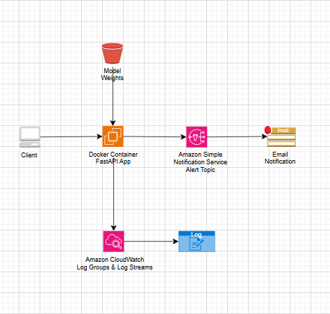

# ViolenceGuard AI — Violence Detection & Alert System

### Overview

ViolenceGuard AI is a video-based violence detection system that combines a deep learning model with a FastAPI inference service, React monitoring dashboard, Docker, and AWS services. Users can upload video clips through the dashboard, trigger ML inference, view the predicted class and confidence score, and receive an Amazon SNS email alert when high-confidence violence is detected. Application logs are collected using Amazon CloudWatch.

The project focuses on the complete path from ML inference to an integrated application: serving a trained video-classification model through an API, connecting it to a frontend, containerizing the backend, deploying it on AWS EC2, sending alerts, and monitoring runtime logs.

### Problem Statement

Violence detection systems are often demonstrated only at the model level, without addressing how such models can be served, monitored, and integrated into real systems.

The system is designed to:
- Accept video inputs
- Perform automated violence detection
- Trigger alerts on high-confidence events
- Be deployed and monitored on AWS using a cost-conscious setup

### Solution Architecture



#### Architecture Design Rationale

1. Amazon EC2 was chosen over serverless options to support long-running video inference, large ML dependencies, and stateful model loading.
2. Docker is used to ensure environment consistency across local development and cloud deployment.
3. FastAPI was selected for its simplicity, performance, and automatic API documentation.
4. Amazon SNS provides a lightweight and reliable email-based alerting mechanism.
5. Amazon CloudWatch Logs are used to centralize application logs for basic observability and debugging.

### Tech Stack Used

**Machine Learning**
- Python
- TensorFlow
- MobileNetV2 + BiLSTM 

**Frontend**
- React
- Vite
- JavaScript

**Backend & Deployment**
- FastAPI
- Uvicorn
- Docker

**AWS Services**
- Amazon EC2 (t2.micro)
- Amazon SNS (Email alerts)
- Amazon CloudWatch (Logs)

### Model Inference Logic

Input video is read frame-by-frame using OpenCV. The frames are first resized and normalised, then a fixed sequence is passed to the model. The model was trained from scratch locally and reused here only for inference. Predictons are smoothed using a sliding window. Final output includes label (Violence / NonViolence), confidence score, alert (flag), timestamp.

### API Interface

**Endpoint:** `POST /predict`

**Request:** Multipart form-data containing a supported video file (`.mp4`, `.avi`, `.mov`, `.mkv`)

**Response (Example):**
```json
{
  "timestamp": "2025-12-31T13:51:38.589657",
  "label": "Violence",
  "confidence": 0.9998,
  "alert": true
}
```


### Alerting System (SNS)

Alerts are published programmatically from FastAPI. Email notifications were verified during testing.
This setup enables immediate notification during testing and demonstrations without relying on external services or paid tooling.


### Logging & Monitoring

Application logs are written to stdout and collected using the CloudWatch Agent on the EC2 instance. Logs are forwarded to CloudWatch Log Groups and Log Streams and used for inference debugging, alert verification, and basic runtime monitoring.

No custom metrics or alarms were configured to remain within AWS Free Tier limits.


### React Monitoring Dashboard

The `frontend/` directory contains a React + Vite monitoring dashboard for the inference service.

**Dashboard flow:**
1. Select or drag-and-drop a video clip.
2. The frontend sends the video as multipart form-data to the FastAPI `/predict` endpoint.
3. FastAPI runs the MobileNetV2 + BiLSTM inference pipeline.
4. The dashboard displays the predicted class, confidence score, alert state, and inference timestamp.

**Run locally:**

Terminal 1 — backend:
```bash
uvicorn app.predict:app --reload --port 8000
```

Terminal 2 — frontend:
```bash
cd frontend
npm install
npm run dev
```

The dashboard opens at `http://localhost:5173` and uses `http://localhost:8000` as the default API URL. To connect it to a deployed backend, create `frontend/.env.local`:
```env
VITE_API_URL=http://<EC2-PUBLIC-IP>:8000
```

The FastAPI service includes CORS configuration for the local React development server.

### Docker & AWS Deployment
```bash
#Launch EC2 & connect
ssh -i "your-key.pem" ubuntu@<EC2-PUBLIC-IP>

#Install Docker (if not already)
sudo apt update
sudo apt install -y docker.io
sudo systemctl start docker

#Clone Project
git clone https://github.com/Reetkapoor/ViolenceGuard-AI.git

#Build the Docker image
docker build -t violence-detector .

#Run with AWS SNS alerts enabled
docker run -d -p 8000:8000 \
  -e AWS_ACCESS_KEY_ID=xxxx \
  -e AWS_SECRET_ACCESS_KEY=xxxx \
  -e AWS_DEFAULT_REGION=xxxx \
  -e SNS_TOPIC_ARN=xxxx \
  violence-detector

#Run without AWS integration (local inference only)
docker run -p 8000:8000 violence-detector
```
Access API documentation:
```bash
http://<EC2-PUBLIC-IP>:8000/docs
```
### Project Structure

```text
ViolenceGuard-AI/
├── app/                    # FastAPI application and inference logic
├── frontend/               # React + Vite monitoring dashboard
├── tests/                  # Pytest API tests
├── Images/                 # Architecture and deployment screenshots
├── Weights/                # Trained model weights
├── Dockerfile              # Backend container image
├── requirements.txt        # Python dependencies
└── .github/workflows/      # GitHub Actions CI
```

### Challenges Faced
- Converting a standalone ML script into a long-running API service
- Handling video-based inference on CPU-only infrastructure
- Designing alert logic that avoids false positives
- Keeping the entire system within AWS Free Tier limits

### Limitations
- Input is video clips, not live CCTV streams
- Single-instance deployment (no autoscaling)
- Model weights are packaged locally, not via S3
- CPU-only inference

These limitations were accepted intentionally to ensure:
- Cost control
- Simplicity
- Clear ownership of the entire system

### Key Learning Outcomes
- ML model deployment is more than training
- Docker is critical for reproducibility
- Alerting systems are as important as prediction accuracy
- Cloud logging is essential for observability

### Data Sources
[https://www.kaggle.com/datasets/mohamedmustafa/real-life-violence-situations-dataset](https://www.kaggle.com/datasets/mohamedmustafa/real-life-violence-situations-dataset)

### Similar Products
1. [https://www.abtosoftware.com/blog/violence-detection](https://www.abtosoftware.com/blog/violence-detection)
2. [https://appsource.microsoft.com/en-us/product/web-apps/oddityaibv1590144351772.violence_detection?tab=overview](https://appsource.microsoft.com/en-us/product/web-apps/oddityaibv1590144351772.violence_detection?tab=overview)

### Contact Me 
Please feel free to contact me for anything in pertinence to the project.

| Method    | Details                          |
|----------|----------------------------------|
| Email    | reetkapoor2901@gmail.com          |
| LinkedIn | https://www.linkedin.com/in/reetkapoor |


